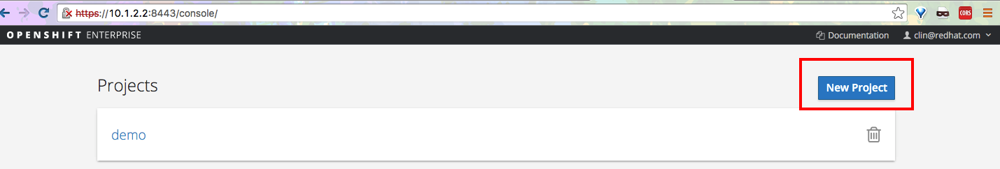
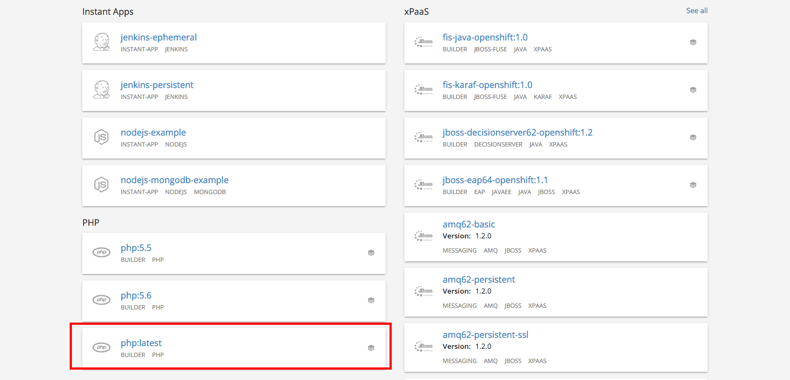
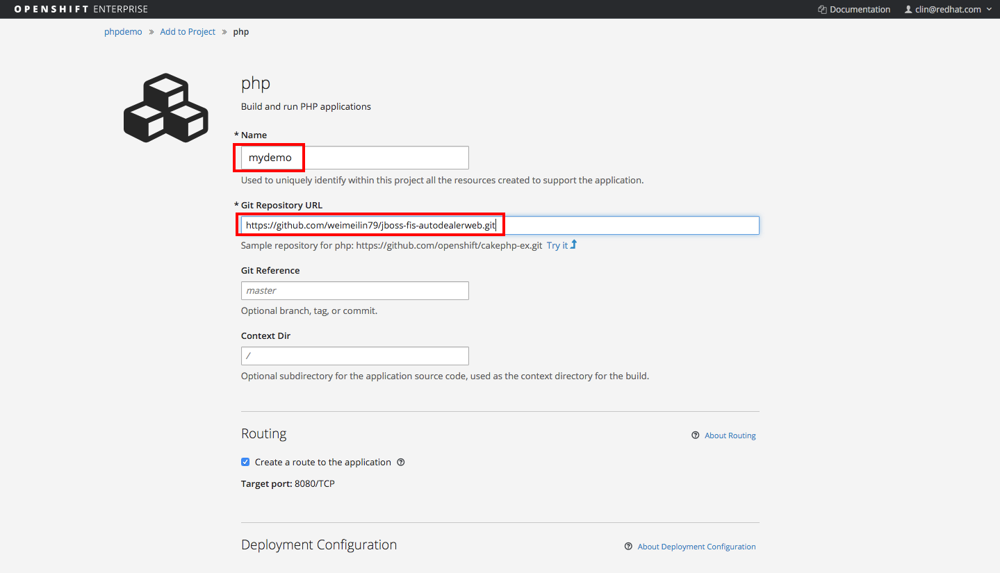
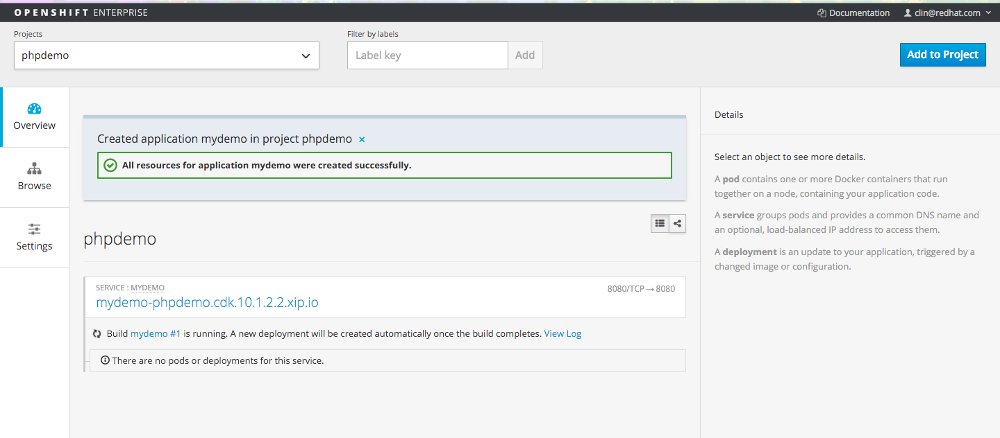
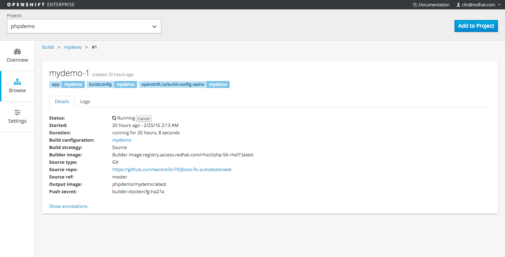
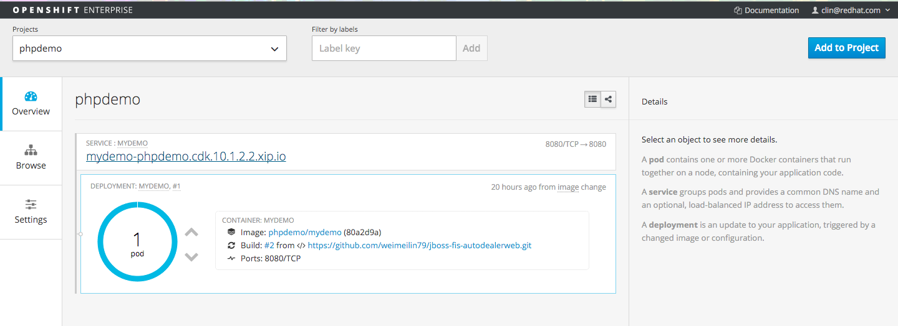

# Fuse Integration Service - Auto Dealership Management System
This application is a Javascript HTML web application support JBoss Fuse Integration service application, Auto Dealership Management System. In this simple application, it contains two major functions: 

1. Sales Report 
2. GPS location generator and alert console

Before installing this application, make sure you have OpenShift installed on your laptop or have access to an OpenShift platform
for more installation details, please go to my blog at: 
http://wei-meilin.blogspot.tw/2016/01/fuse-integration-service-getting-your_19.html

Installation:

Go to OpenShift console under https://10.1.2.2:8443/login, click on "New Project", name anything you want.

Start creating a PHP application by using the templates/image provide by OpenShift

Name your application mydemo, and point the source to this github repository, or your own if you prefer.

You will now see the application building, with a pod running. 

To access the application:

 1. Sales Report 
 http://mydemo-phpdemo.cdk.10.1.2.2.xip.io/sales/sales.html
 2. GPS location generator and alert console
 http://mydemo-phpdemo.cdk.10.1.2.2.xip.io/gps/startGPSlocation.html
 http://mydemo-phpdemo.cdk.10.1.2.2.xip.io/gps/vehiclenearbyconsole.html